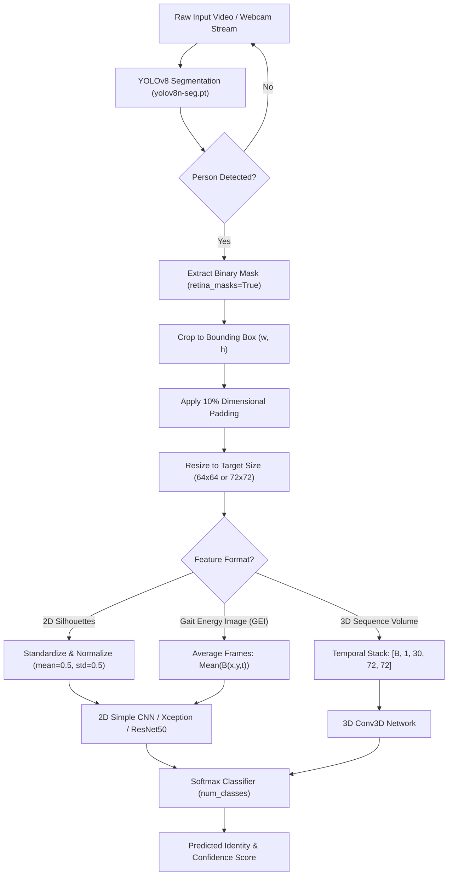
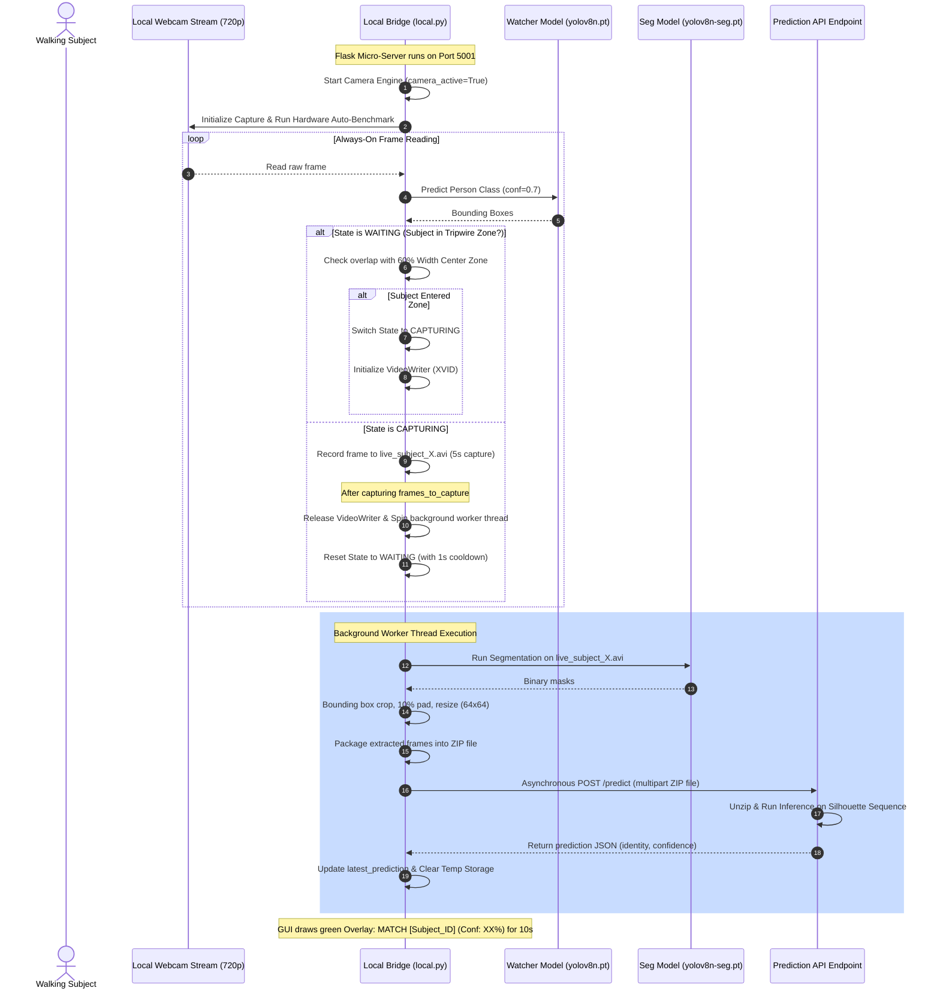

# 🚶‍♂️ GAIT-Based Biometric Recognition System

[](https://www.python.org/)
[](https://pytorch.org/)
[](https://github.com/ultralytics/ultralytics)
[](https://flask.palletsprojects.com/)
[](https://fastapi.tiangolo.com/)

A state-of-the-art **Gait-Based Biometric Recognition System** that identifies individuals by their walking patterns (gait). The system features an end-to-end pipeline covering raw video ingestion, high-precision silhouette extraction using **YOLOv8 instance segmentation**, spatial-temporal representation engineering (Gait Energy Images & 3D temporal volumes), deep neural network classification (2D/3D CNNs, Xception, and ResNet-50), and an always-on webcam-based real-time scanning bridge.

---

## 📌 Table of Contents
- [System Pipeline Architecture](#-system-pipeline-architecture)
- [Key Features](#-key-features)
- [Repository Structure](#-repository-structure)
- [Data Engineering & Preprocessing](#-data-engineering--preprocessing)
  - [Silhouette Extraction Pipeline](#1-silhouette-extraction-pipeline)
  - [Gait Energy Image (GEI) Generation](#2-gait-energy-image-gei-generation)
  - [3D Spatio-Temporal Sequence Volumes](#3-3d-spatio-temporal-sequence-volumes)
- [Model Architectures](#-model-architectures)
  - [Simple 2D CNN](#1-simple-2d-cnn)
  - [Simple 3D CNN](#2-simple-3d-cnn)
  - [Deep Transfer Learning (Xception & ResNet50)](#3-deep-transfer-learning-xception--resnet50)
- [Real-Time Biometric Scanner Bridge (`local.py`)](#-real-time-biometric-scanner-bridge-localpy)
  - [Webcam Scanner Workflow](#webcam-scanner-workflow)
  - [Flask Remote Control API](#flask-remote-control-api)
- [Reference FastAPI Prediction Server](#-reference-fastapi-prediction-server)
- [Installation & Setup](#-installation--setup)
- [Usage Instructions](#-usage-instructions)
  - [1. Data Preparation & Engineering](#1-data-preparation--engineering)
  - [2. Model Training](#2-model-training)
  - [3. Running the Local Camera Bridge](#3-running-the-local-camera-bridge)
- [Evaluation & Verification](#-evaluation--verification)

---

## 🔄 System Pipeline Architecture

The overall information flow from a raw webcam stream or recorded video input to the final classified identity prediction is shown below:



---

## ✨ Key Features
- **Precise Silhouette Extraction**: Employs **YOLOv8-Segmentation** (`yolov8n-seg.pt`) to extract clean, pixel-perfect human silhouettes under various lighting conditions, replacing primitive background subtraction.
- **Multiple Feature Representations**:
  - **Individual Silhouettes**: Temporal sequence of normalized human binary shapes.
  - **Gait Energy Images (GEI)**: Averaged spatial-temporal gait templates that capture walking style in a single static frame.
  - **3D Sequence Volumes**: Raw $72\times72$ frame volumes that record full temporal dynamics.
- **Robust Model Zoo**:
  - **Simple 2D CNN**: Light, fast baseline for single silhouettes or GEIs.
  - **Simple 3D CNN**: Spatio-temporal network using `Conv3D` layers to extract dynamic motion features.
  - **Transfer Learning**: State-of-the-art **Xception** (via the `timm` library) and **ResNet50** models fine-tuned for high-accuracy classification.
- **Always-On Webcam Biometric Scanner**:
  - **Zone Tripwire**: Fast object detection (`yolov8n.pt`) monitors a central area (60% width) and automatically triggers video capture when a subject enters.
  - **Asynchronous Processing**: Background thread pool handles segmentation, directory zipping, API transmission, and local cleanup without blocking the active camera feed.
  - **Flask Control Bridge**: Hosts a control dashboard on port 5001, exposing endpoints `/start_camera` and `/stop_camera`.
  - **Majority Voting**: A frame-by-frame voter system that evaluates sequences and outputs a consensus identity prediction to eliminate single-frame outliers.
- **Scalable Dataset Support**: Pre-configured for the **CASIA-B** dataset (124 subjects, 11 viewing angles, 3 conditions) and a custom 10-subject real-world validation dataset.

---

## 📂 Repository Structure

```directory
GAIT-Based-Biometric-Recognition-System/
│
├── CASIA - B/                      # Raw and structured CASIA-B dataset folders
│   └── CASIA - B/                  # Silhouettes grouped by Subjects (001-124)
│
├── data/                           # Standard dataset storage
│   ├── train/                      # Raw custom training images
│   ├── train_processed/            # Cropped and resized training silhouettes (72x72)
│   ├── validation/                 # Raw custom validation images
│   └── validation_processed/       # Cropped and resized validation silhouettes (72x72)
│
├── Data Engineering/               # Notebooks for preprocessing and dataset generation
│   ├── gait_90.ipynb               # 90° view-angle silhouette preprocessing pipeline
│   ├── gait_90_2.ipynb             # Silhouette pipeline revision 2
│   ├── gait_90_4.ipynb             # Silhouette pipeline revision 4 with TF options
│   ├── gait_gei.ipynb              # Gait Energy Image (GEI) generator from frame folders
│   ├── gait_gei_py.ipynb           # GEI dataset builder and PyTorch training wrapper
│   └── gait_sequence_3D.ipynb      # 3D volume stack dataset builder & 3D CNN definition
│
├── Data Pipelining/                # Hardware streaming and local pipeline tools
│   ├── live_pipeline.ipynb         # Prototyping notebook for real-time video inference
│   └── local.py                    # Production Flask server & always-on camera scanner
│
├── Data Visualisation/             # Evaluation and metrics visualization
│   └── gait_exception_with_plots.ipynb # Computes Confusion Matrices, ROC/AUC, Loss graphs
│
├── EDA/                            # Exploratory Data Analysis
│   ├── gait.ipynb                  # Initial analysis of CASIA-B structure and frame counts
│   ├── gait1.ipynb                 # Subject distribution and video duration assessments
│   └── gait3.ipynb                 # Statistics on frame rates and silhouette dimensions
│
├── Model Training/                 # Training notebooks for deep learning models
│   ├── gait_Xception.ipynb         # PyTorch training of Xception and baseline Simple2DCNN
│   ├── gait_Xception extended.ipynb # Fine-tuning configurations and longer epoch runs
│   └── training_history.json       # Training and validation accuracy/loss logs
│
├── Models/                         # Pre-trained and fine-tuned model checkpoint directory
│   ├── gait_ResNet50_entire_model.pth           # Full ResNet50 model definition and weights
│   ├── gait_ResNet50_weights.pth                # ResNet50 state_dict weights
│   ├── gait_simple_cnn_entire_model.pth         # Full SimpleCNN model definition and weights
│   ├── gait_simple_cnn_weights.pth              # SimpleCNN state_dict weights
│   ├── gait_xception_model_final123_subjects.pth # Fine-tuned Xception on 123 CASIA-B subjects
│   ├── gait_xception_model_overall123_subjects.pth # Overfit safety checkpoint (123 subjects)
│   ├── new_dataset_gait_xception.pth            # Fine-tuned Xception weights (custom dataset)
│   └── new_dataset_gait_xception_FULL.pth        # Full Xception model (10 custom subjects)
│
├── Real World Inferencing/         # Validation on custom local datasets
│   ├── class_mapping.json          # ID mapping for custom subjects (0-9)
│   ├── new_data_train.ipynb        # Fine-tuning model on real-world web-captured dataset
│   └── new_data_train1.ipynb       # Confusion matrix, ROC, and majority voting validation
│
├── requirements.txt                # System dependency configuration
├── yolov8n.pt                      # Watcher model weights (Ultralytics YOLO nano)
└── yolov8n-seg.pt                  # Silhouette extractor segmentation weights (YOLO nano seg)
```

---

## 🛠️ Data Preprocessing & Engineering

### 1. Silhouette Extraction Pipeline
Implemented in [gait_90.ipynb](file:///d:/vit study/Machine Learning/Gait/Data Engineering/gait_90.ipynb) and [local.py](file:///d:/vit study/Machine Learning/Gait/Data Pipelining/local.py):
1. **Mask Extraction**: YOLOv8-seg detects a human subject and outputs a high-resolution binary mask.
2. **Crop to Bounding Box**: Uses OpenCV's `boundingRect` to find the exact margins $(x, y, w, h)$ of the segmented human mask:
   ```python
   x, y, w, h = cv2.boundingRect(binary_silhouette)
   ```
3. **Spatial Padding**: Adds a 10% padding boundary around the bounding box to ensure spatial details (like the head contour and shoe tips) are not cut off during resizing:
   ```python
   pad_w = int(w * 0.10)
   pad_h = int(h * 0.10)
   x1 = max(x - pad_w, 0); y1 = max(y - pad_h, 0)
   x2 = min(x + w + pad_w, frame_width); y2 = min(y + h + pad_h, frame_height)
   cropped_person = binary_silhouette[y1:y2, x1:x2]
   ```
4. **Rescaling**: Resizes the cropped silhouette to a standardized $64 \times 64$ or $72 \times 72$ grid using area interpolation (`cv2.INTER_AREA`), producing a consistent dimensional shape.

### 2. Gait Energy Image (GEI) Generation
Implemented in [gait_gei.ipynb](file:///d:/vit study/Machine Learning/Gait/Data Engineering/gait_gei.ipynb):
A Gait Energy Image (GEI) condenses an entire sequence of walking silhouettes into a single grayscale representation. For a sequence of $N$ silhouette frames, the GEI is computed as:

$$\text{GEI}(x, y) = \frac{1}{N} \sum_{t=1}^{N} B(x, y, t)$$

where $B(x, y, t)$ is the $t$-th frame in the sequence.

```python
def create_gei_from_sequence(sequence_path):
    frame_files = sorted([f for f in os.listdir(sequence_path) if f.endswith('.png')])
    gei = None
    frame_count = 0
    for frame_file in frame_files:
        frame_path = os.path.join(sequence_path, frame_file)
        frame = cv2.imread(frame_path, cv2.IMREAD_GRAYSCALE)
        if gei is None:
            gei = np.zeros_like(frame, dtype=np.float32)
        gei += frame.astype(np.float32) / 255.0
        frame_count += 1
    if frame_count > 0:
        gei = gei / frame_count
    return (gei * 255).astype(np.uint8)
```

### 3. 3D Spatio-Temporal Sequence Volumes
Implemented in [gait_sequence_3D.ipynb](file:///d:/vit study/Machine Learning/Gait/Data Engineering/gait_sequence_3D.ipynb):
Instead of averaging, individual frames can be grouped into sequential stacks of a fixed length (e.g., 30 frames). This forms a 3D spatio-temporal tensor of shape `[Batch, Channels, Sequence_Length, Height, Width]`, representing a dynamic window of the user's gait.

---

## 🧠 Model Architectures

### 1. Simple 2D CNN
Defined in [gait_Xception.ipynb](file:///d:/vit study/Machine Learning/Gait/Model Training/gait_Xception.ipynb):
A lightweight PyTorch neural network built for high-speed training on 2D images (like GEIs or single silhouettes).

* **Input Layer**: `3 x 72 x 72` (RGB conversion of normalized silhouettes)
* **Convolutional Block 1**: `Conv2d(3, 16, kernel_size=3, padding=1)` $\rightarrow$ `ReLU` $\rightarrow$ `MaxPool2d(2, 2)` (Output: `16 x 36 x 36`)
* **Convolutional Block 2**: `Conv2d(16, 32, kernel_size=3, padding=1)` $\rightarrow$ `ReLU` $\rightarrow$ `MaxPool2d(2, 2)` (Output: `32 x 18 x 18`)
* **Convolutional Block 3**: `Conv2d(32, 64, kernel_size=3, padding=1)` $\rightarrow$ `ReLU` $\rightarrow$ `MaxPool2d(2, 2)` (Output: `64 x 9 x 9`)
* **Fully Connected Layer 1**: `Linear(64 * 9 * 9, 512)` $\rightarrow$ `ReLU`
* **Output Classifier**: `Linear(512, num_classes)`

### 2. Simple 3D CNN
Defined in [gait_sequence_3D.ipynb](file:///d:/vit study/Machine Learning/Gait/Data Engineering/gait_sequence_3D.ipynb):
A neural network using `Conv3D` layers to extract motion features across frames.

* **Input Tensor**: `[B, 1, 30, 72, 72]` (Batch, Channel, Sequence Length, Height, Width)
* **Conv3D Block 1**: `Conv3d(1, 16, kernel_size=3, padding=1)` $\rightarrow$ `ReLU` $\rightarrow$ `BatchNorm3d(16)` $\rightarrow$ `MaxPool3d(kernel_size=(2, 2, 2))` (Output: `[B, 16, 15, 36, 36]`)
* **Conv3D Block 2**: `Conv3d(16, 32, kernel_size=3, padding=1)` $\rightarrow$ `ReLU` $\rightarrow$ `BatchNorm3d(32)` $\rightarrow$ `MaxPool3d(kernel_size=(2, 2, 2))` (Output: `[B, 32, 7, 18, 18]`)
* **Conv3D Block 3**: `Conv3d(32, 64, kernel_size=3, padding=1)` $\rightarrow$ `ReLU` $\rightarrow$ `BatchNorm3d(64)` $\rightarrow$ `MaxPool3d(kernel_size=(2, 2, 2))` (Output: `[B, 64, 3, 9, 9]`)
* **Classifier Block**:
  * `Flatten` (Size: `64 * 3 * 9 * 9 = 15,552` elements)
  * `Linear(15552, 1024)` $\rightarrow$ `ReLU` $\rightarrow$ `Dropout(p=0.5)`
  * `Linear(1024, 512)` $\rightarrow$ `ReLU` $\rightarrow$ `Dropout(p=0.5)`
  * `Linear(512, num_classes)`

### 3. Deep Transfer Learning (Xception & ResNet50)
Defined in [gait_Xception.ipynb](file:///d:/vit study/Machine Learning/Gait/Model Training/gait_Xception.ipynb) and [new_data_train1.ipynb](file:///d:/vit study/Machine Learning/Gait/Real World Inferencing/new_data_train1.ipynb):
* **Xception**: Loaded via the `timm` library with pre-trained ImageNet weights. The final fully connected layer is replaced to output the target number of classes (123 for CASIA-B or 10 for custom subjects). The model is optimized using Adam (`lr=0.001`), utilizing Cross-Entropy loss and PyTorch's Automatic Mixed Precision (AMP) package (`autocast` + `GradScaler`) for hardware acceleration.
* **ResNet50**: PyTorch's pre-trained ResNet50 architecture fine-tuned on silhouette datasets.

---

## 🎥 Real-Time Biometric Scanner Bridge (`local.py`)

[local.py](file:///d:/vit study/Machine Learning/Gait/Data Pipelining/local.py) connects a local USB/integrated webcam capture loop to the remote prediction server.

### Webcam Scanner Workflow

The sequence of events during a real-time scan is detailed below:



### Flask Remote Control API
`local.py` runs a background Flask thread to control the camera hardware:
* **`GET /`**: Home control dashboard with simple trigger buttons.
* **`GET /start_camera`**: Activates the camera loop thread.
* **`GET /stop_camera`**: Safe shutdown of the webcam loop, releasing the hardware.

---

## 📡 Reference FastAPI Prediction Server

Below is the reference implementation of the FastAPI server that acts as the prediction API endpoint (listening on port 8000). It receives a zip file of silhouettes, performs frame-by-frame inference using the fine-tuned model, and computes the final identity using a majority voting scheme.

```python
import os
import shutil
import zipfile
import torch
import numpy as np
import timm
from collections import Counter
from fastapi import FastAPI, UploadFile, File, HTTPException
from fastapi.middleware.cors import CORSMiddleware
from PIL import Image
from torchvision import transforms

app = FastAPI(title="Gait Recognition Inference API")

# Enable CORS for communication with local dashboard
app.add_middleware(
    CORSMiddleware,
    allow_origins=["*"],
    allow_credentials=True,
    allow_methods=["*"],
    allow_headers=["*"],
)

# Configuration
MODEL_PATH = "Models/new_dataset_gait_xception_FULL.pth"
NUM_CLASSES = 10
CLASS_MAPPING = {
    0: "Adarsh", 1: "Aditi", 2: "Aman", 3: "Ankit", 4: "Himanshu",
    5: "Jyotibrat", 6: "Kunal", 7: "Swayam", 8: "Tiwari", 9: "Ujjwal"
}
TEMP_DIR = "server_temp"

# Load Model
device = torch.device("cuda" if torch.cuda.is_available() else "cpu")
model = timm.create_model('xception', pretrained=False, num_classes=NUM_CLASSES)
model.load_state_dict(torch.load(MODEL_PATH, map_location=device))
model.to(device)
model.eval()

# Transformation pipeline
predict_transform = transforms.Compose([
    transforms.Resize((64, 64)),
    transforms.ToTensor(),
    transforms.Normalize([0.5, 0.5, 0.5], [0.5, 0.5, 0.5])
])

@app.post("/predict")
async def predict_gait(file: UploadFile = File(...)):
    if not file.filename.endswith(".zip"):
        raise HTTPException(status_code=400, detail="Only ZIP archives containing silhouettes are accepted.")
    
    # Setup directories
    if os.path.exists(TEMP_DIR):
        shutil.rmtree(TEMP_DIR)
    os.makedirs(TEMP_DIR)
    
    zip_path = os.path.join(TEMP_DIR, file.filename)
    extract_path = os.path.join(TEMP_DIR, "extracted_frames")
    
    # Save the upload file
    with open(zip_path, "wb") as buffer:
        shutil.copyfileobj(file.file, buffer)
        
    # Extract ZIP
    with zipfile.ZipFile(zip_path, 'r') as zip_ref:
        zip_ref.extractall(extract_path)
        
    # Find all extracted frames
    frame_files = []
    for root, _, files in os.walk(extract_path):
        for name in files:
            if name.lower().endswith(('.png', '.jpg', '.jpeg')):
                frame_files.append(os.path.join(root, name))
                
    if not frame_files:
        shutil.rmtree(TEMP_DIR)
        raise HTTPException(status_code=400, detail="No silhouette image frames found in ZIP.")
    
    # Inference loop (Accumulating scores for majority voting)
    predictions = []
    confidences = []
    
    with torch.no_grad():
        for frame_file in frame_files:
            try:
                # Open image and convert to RGB
                img = Image.open(frame_file).convert("RGB")
                tensor = predict_transform(img).unsqueeze(0).to(device)
                
                # Forward pass
                outputs = model(tensor)
                probs = torch.nn.functional.softmax(outputs, dim=1)
                
                confidence, pred_class = torch.max(probs, dim=1)
                predictions.append(pred_class.item())
                confidences.append(confidence.item())
            except Exception as e:
                print(f"Skipped frame {frame_file} due to error: {e}")
                continue
                
    # Clean up temp folder
    shutil.rmtree(TEMP_DIR)
    
    if not predictions:
        raise HTTPException(status_code=500, detail="Model failed to process frame batch.")
        
    # Apply Majority Voting
    vote_counter = Counter(predictions)
    most_common_class, votes = vote_counter.most_common(1)[0]
    
    # Compute stats
    subject_name = CLASS_MAPPING.get(most_common_class, f"Subject_{most_common_class:03d}")
    average_confidence = np.mean([conf for idx, conf in zip(predictions, confidences) if idx == most_common_class])
    voting_agreement = votes / len(predictions)
    
    return {
        "prediction": subject_name,
        "confidence": float(average_confidence),
        "voting_agreement": float(voting_agreement),
        "total_frames_evaluated": len(predictions)
    }

if __name__ == "__main__":
    import uvicorn
    uvicorn.run(app, host="0.0.0.0", port=8000)
```

---

## 🔧 Installation & Setup

1. **Clone the Repository**:
   ```bash
   git clone https://github.com/ankit1831/GAIT-Based-Biometric-Recognition-System.git
   cd GAIT-Based-Biometric-Recognition-System
   ```

2. **Configure Virtual Environment**:
   ```bash
   python -m venv venv
   # On Windows:
   venv\Scripts\activate
   # On macOS/Linux:
   source venv/bin/activate
   ```

3. **Install Dependencies**:
   Configure PyTorch with CUDA support matching your system, then install the packages listed in [requirements.txt](file:///d:/vit study/Machine Learning/Gait/requirements.txt):
   ```bash
   pip install -r requirements.txt
   ```
   *Note: Install `timm`, `opencv-python`, `flask`, `flask-cors`, `requests`, and `ultralytics` if not automatically resolved.*

4. **Verify Pre-Trained Weights**:
   Ensure the following pre-trained models are located in the root directory:
   - `yolov8n.pt` (Tripwire watcher model)
   - `yolov8n-seg.pt` (Silhouette segmenter model)

---

## 🚀 Usage Instructions

### 1. Data Preparation & Engineering
- **CASIA-B Processing**:
  Open and execute the cells in [gait_90.ipynb](file:///d:/vit study/Machine Learning/Gait/Data Engineering/gait_90.ipynb) to process the raw CASIA-B database. The processed frames will be cropped, resized, and saved in `data/train_processed` and `data/validation_processed`.
- **Gait Energy Images**:
  To train models using GEIs, run the generator in [gait_gei.ipynb](file:///d:/vit study/Machine Learning/Gait/Data Engineering/gait_gei.ipynb) to construct static templates.

### 2. Model Training
Open the notebooks in `Model Training/` directory to run the training steps:
* Run [gait_Xception.ipynb](file:///d:/vit study/Machine Learning/Gait/Model Training/gait_Xception.ipynb) to train either the baseline 2D CNN or the transfer-learned Xception network on the CASIA-B dataset.
* Adjust `NUM_SUBJECTS_TO_TRAIN` to limit class size (e.g., to 123 subjects).
* Model checkpoints will be saved in the `Models/` directory upon training completion.

### 3. Running the Local Camera Bridge
1. Start the prediction API server (see [FastAPI Server script](#-reference-fastapi-prediction-server)) on your hosting device (e.g., port 8000).
2. Configure the API endpoint URL in [local.py](file:///d:/vit study/Machine Learning/Gait/Data Pipelining/local.py):
   ```python
   my_api_url = "http://YOUR_SERVER_IP:8000/predict"
   ```
3. Run the camera bridge:
   ```bash
   python "Data Pipelining/local.py"
   ```
4. Access the web control interface at `http://localhost:5001` and click **Start Camera** to activate the biometric tripwire capture loops. Press `q` while looking at the OpenCV stream window to turn the camera engine off.

---

## 📊 Evaluation & Verification

To verify model accuracy, compute performance metrics, and create visualizations, execute [gait_exception_with_plots.ipynb](file:///d:/vit study/Machine Learning/Gait/Data Visualisation/gait_exception_with_plots.ipynb):
- **Confusion Matrix**: Shows inter-class similarities and misclassifications (e.g., confusion between subjects due to clothing variations).
- **ROC and AUC Curves**: Measures model classification performance.
- **Accuracy/Loss Graphs**: Plots training and validation history logs over epochs from [training_history.json](file:///d:/vit study/Machine Learning/Gait/Model Training/training_history.json).
- **Majority Voting Logs**: Displays voting consensus (e.g., "Tiwari" predicted in 28 out of 35 frames).
